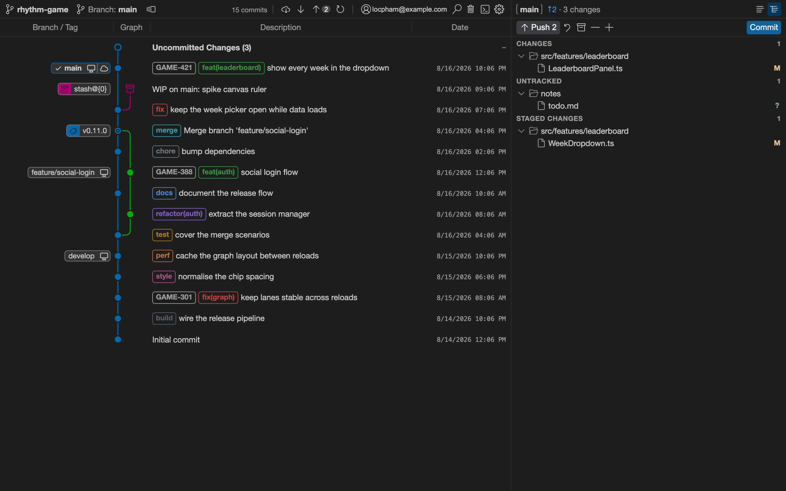
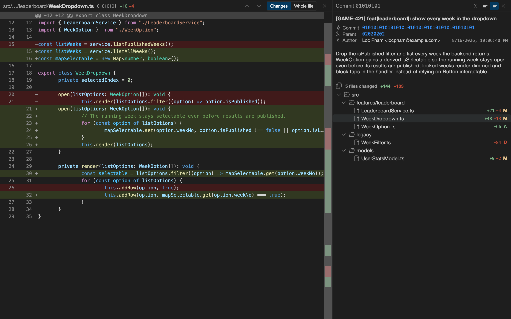
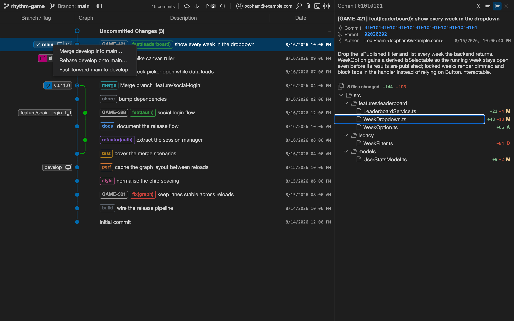
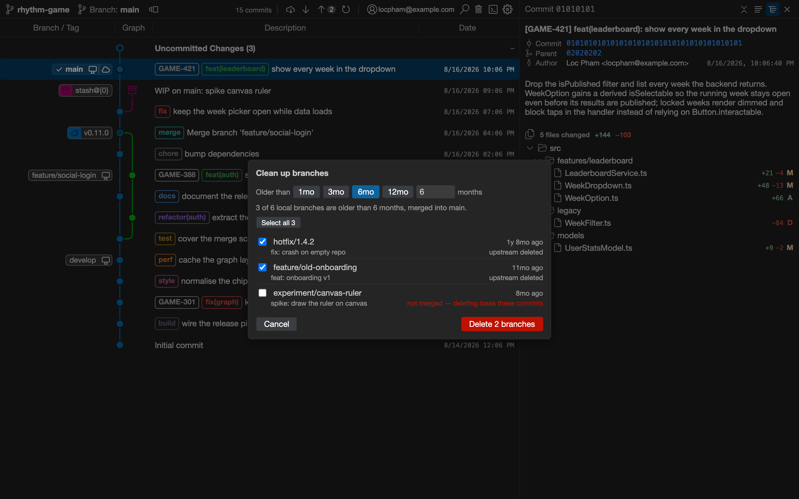

# git-octopus

A Git graph client for Visual Studio Code — view your repository's commit graph and perform Git
actions from it.

> **Clean-room note.** git-octopus is an independent, from-scratch reimplementation inspired by the
> _Git Graph_ extension. It reuses none of Git Graph's source code or assets. It is licensed under
> the MIT License and is not affiliated with or endorsed by the original project.

## Install

No Marketplace listing yet, so install the packaged extension directly:

```bash
git clone https://github.com/locphamduc96/git-octopus.git
cd git-octopus
pnpm install
pnpm package
code --install-extension git-octopus.vsix --force
```

Reload the window, then open the view from the Git Octopus item in the status bar, or run
**Git Octopus: Open Git Octopus** — or **Open Git Octopus in Editor Tab** — from the Command Palette.

Requires VS Code 1.90 or newer, Node 20+, pnpm, and `git` on your PATH.

## What it does

Commit graph with branch lanes and colours · branch, tag and stash chips · commit details with the
file list as a flat list or a folder tree · file icons from whichever icon theme you use · working
tree: stage, unstage, discard, stash, commit, undo commit · diff any file, or compare two commits
with Ctrl/Cmd + click · fetch, pull, push and force-push with confirmation · 20+ Git actions from the
commit menu · find (Ctrl+F) · several repositories in one workspace.

## Screenshots

Taken against a demo repository; the full set lives in [docs/screenshots](docs/screenshots).









## Architecture

pnpm monorepo (architecture decisions live in the author's `project-notes/`, outside this repo):

```
packages/
├── shared/        # type-only: domain model + host↔webview message protocol
├── graph-layout/  # pure engine: Commit[] → GraphRow[]
├── extension/     # VS Code host (hexagonal: core / adapters / app)
└── webview/       # Svelte 5 + Vite UI (feature-sliced)
```

## Development

```bash
pnpm install
pnpm dev          # watch: build webview + extension
pnpm test         # run unit tests (Vitest)
pnpm lint
pnpm package      # produce a .vsix
```

Then press <kbd>F5</kbd> in VS Code to launch the Extension Development Host.

## License

[MIT](LICENSE) © 2026 locpham

Third-party assets:

- [VS Code Codicons](https://github.com/microsoft/vscode-codicons) — icon font, CC BY 4.0 © Microsoft.
- [GitHub Octicons](https://github.com/primer/octicons) — the branch, remote and checked-out glyphs
  drawn in the ref chips, MIT © GitHub Inc.
